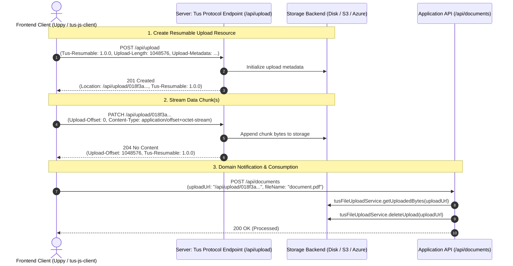
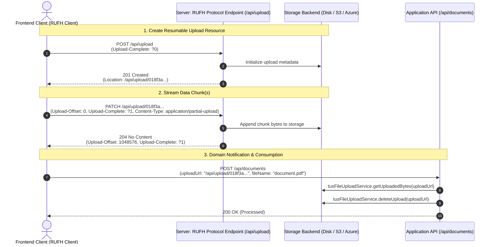

[](https://central.sonatype.com/artifact/me.desair.tus/tus-java-server) [](https://adoptium.net) [](https://github.com/tomdesair/tus-java-server/actions?query=branch%3Amaster+) [](https://coveralls.io/github/tomdesair/tus-java-server?branch=master) [](https://sonarcloud.io/dashboard?id=me.desair.tus%3Atus-java-server) [](https://sonarcloud.io/dashboard?id=me.desair.tus%3Atus-java-server) [](https://sonarcloud.io/dashboard?id=me.desair.tus%3Atus-java-server)

# tus-java-server
This library can be used to enable resumable (and potentially asynchronous) file uploads in any Java web application. This allows the users of your application to upload large files over slow and unreliable internet connections. The ability to pause or resume a file upload (after a connection loss or reset) is achieved by implementing the open file upload protocols tus (https://tus.io/) and Resumable Uploads for HTTP (RUFH). This library implements the server-side of the tus v1.0.0 protocol as well as the official IETF Resumable Uploads for HTTP specification ([draft-ietf-httpbis-resumable-upload](https://datatracker.ietf.org/doc/draft-ietf-httpbis-resumable-upload/)), offering dual protocol version support.

The Javadoc of this library can be found at https://tus.desair.me/. As of version 2.0.0, this library requires Java 17+.

### Key Features
* ⚡ **Dual Protocol Support**: Seamless interoperability with [Tus 1.0.0](https://tus.io/) and the official [IETF Resumable Uploads for HTTP (draft-12)](https://datatracker.ietf.org/doc/draft-ietf-httpbis-resumable-upload/).
* ☁️ **Pluggable Storage Backends**: Native support for Local Disk, NFS network shares, S3-compatible Object Storage (AWS S3, MinIO, Cloudflare R2, Ceph, GCS), and Azure Blob Storage.
* 🔒 **Zero-Database Distributed Locking**: Built-in lease-based locking enabling multi-replica cluster & Kubernetes container deployments without requiring Redis or relational databases.
* 🛡️ **Data Integrity & Resiliency**: Built-in HTTP Digests ([RFC 9530](https://www.rfc-editor.org/rfc/rfc9530.html)), checksum verification, and duplicate upload deduplication.
* 🚀 **Production-Ready & Lightweight**: Minimal dependencies (Jakarta Servlet API 6.0 & Apache Commons), non-blocking lock contention resolution, and thread-local caching.

## Table of Contents
- [Storage Backend Options](#storage-backend-options)
- [How Resumable Uploads Work](#how-resumable-uploads-work)
- [Quick Start and Examples](#quick-start-and-examples)
- [Usage and Configuration](#usage-and-configuration)
  - [1. Setup & Configuration Options](#1-setup)
  - [2. Processing an upload](#2-processing-an-upload)
  - [3. Handling Upload Completion & Retrieving Files](#3-handling-upload-completion--retrieving-files)
  - [4. Upload cleanup](#4-upload-cleanup)
- [Protocol Version Support (Tus 1.0.0 & IETF Resumable Uploads)](#protocol-version-support-tus-100--ietf-resumable-uploads)
- [Protocol Extensions](#protocol-extensions)
- [Advanced Usage](#advanced-usage)
  - [HTTP Digests (RFC 9530)](#http-digests-rfc-9530)
  - [Emitting HTTP 104 Interim Responses in Tomcat / Spring Boot](#emitting-http-104-interim-responses-in-tomcat--spring-boot)
- [Compatible Client Implementations & Conformity Testing](#compatible-client-implementations--conformity-testing)
- [Versioning](#versioning)
- [Contributing](#contributing)

## Storage Backend Options

`tus-java-server` provides pluggable storage architecture supporting multiple backend storage options:

1. **File Disk & Network Storage** (`DiskStorageService` & `LeaseFileLockingService`):
   - **Local File System**: Direct disk storage on application server instance.
   - **Shared NFS Network Drives**: Distributed, container-safe lease locking for multi-server setups (NFSv3/v4, AWS EFS, Azure Files, SMB/CIFS). See [Disk & Network Storage Locking Guide](docs/DISK_BASED_LOCKING.md).
   - **Kubernetes Persistent Volume**: Mounted volume (`ReadWriteMany` / `ReadWriteOnce`) for containerized applications.
2. **S3-Compatible Object Storage** (`S3StorageService`, `S3LockingService`, & `S3ConcatenationService`):
   - **Cloud & On-Premise S3**: AWS S3, MinIO, Cloudflare R2, Ceph, or Google Cloud Storage.
   - **Multi-Replica Support**: Uses distributed S3 object locking and TTL leases, enabling multi-replica container deployments without requiring Redis or external databases. See [S3 Storage Guide](docs/S3_STORAGE.md).
3. **Azure Blob Storage** (`AzureBlobStorageService`, `AzureBlobLockingService`, & `AzureBlobConcatenationService`):
   - **Microsoft Azure Cloud**: Native Azure Blob Storage using the `azure-storage-blob` SDK.
   - **Multi-Replica Support**: Uses native Azure Blob Leases (30s renewable leases) for distributed locking across cluster replicas. See [Azure Blob Storage Guide](docs/AZURE_BLOB_STORAGE.md).

## How Resumable Uploads Work

### Tus 1.0.0 Protocol Flow


### IETF Resumable Uploads for HTTP (RUFH) Flow


## Quick Start and Examples
The tus-java-server library only depends on Jakarta Servlet API 6.0 and some Apache Commons utility libraries. This
means that (in theory) you can use this library on any modern Java Web Application server like Tomcat, JBoss, Jetty... By default all uploaded data and information is stored on a (shared) file system of the application server.

You can add the latest stable version of this library to your application using Maven or Gradle:

**Maven:**
```xml
<dependency>
  <groupId>me.desair.tus</groupId>
  <artifactId>tus-java-server</artifactId>
  <version>2.0.0</version>
</dependency>
```

**Gradle (Groovy):**
```groovy
implementation 'me.desair.tus:tus-java-server:2.0.0'
```

**Gradle (Kotlin):**
```kotlin
implementation("me.desair.tus:tus-java-server:2.0.0")
```

When using S3 storage (`S3StorageService`) using the MinIO Java SDK or enabling JSON metadata serialization (`withJsonSerialization()`), also include the Jackson and MinIO dependencies matching `pom.xml`:

```xml
<dependency>
  <groupId>io.minio</groupId>
  <artifactId>minio</artifactId>
  <version>9.0.3</version>
</dependency>
<dependency>
  <groupId>com.fasterxml.jackson.core</groupId>
  <artifactId>jackson-databind</artifactId>
  <version>2.22.1</version>
</dependency>
<dependency>
  <groupId>com.fasterxml.jackson.core</groupId>
  <artifactId>jackson-annotations</artifactId>
  <version>2.22</version>
</dependency>
```

The main entry point of the library is the `me.desair.tus.server.TusFileUploadService.process(jakarta.servlet.http.HttpServletRequest, jakarta.servlet.http.HttpServletResponse)` method. You can call this method inside a `jakarta.servlet.http.HttpServlet`, a `jakarta.servlet.Filter` or any REST API controller of a framework that gives you access to `HttpServletRequest` and `HttpServletResponse` objects. In the following list, you can find some example implementations:

* [Detailed blog post by Ralph](https://golb.hplar.ch/2019/06/upload-with-tus.html) on how to use this library in [Spring Boot in combination with the Tus JavaScript client](https://github.com/ralscha/blog2019/tree/master/uploadtus).
* [Resumable and asynchronous file upload using Uppy with form submission in Dropwizard (Jetty)](https://github.com/tomdesair/tus-java-server-dropwizard-demo)
* [Resumable and asynchronous file upload in Spring Boot REST API with Uppy JavaScript client.](https://github.com/tomdesair/tus-java-server-spring-demo)
* (more examples to come!)

#### Frontend Client Example (Uppy / JavaScript)
Connect any standard Tus client (e.g. [Uppy](https://uppy.io/) or `tus-js-client`) to your backend upload endpoint:

```javascript
import Uppy from '@uppy/core';
import Tus from '@uppy/tus';

const uppy = new Uppy().use(Tus, {
  endpoint: 'http://localhost:8080/api/upload',
  chunkSize: 5 * 1024 * 1024 // 5MB chunk size
});
```

## Usage and Configuration

### 1. Setup
The first step is to create a `TusFileUploadService` object using its constructor. You can make this object available as a (Spring bean) singleton or create a new instance for each request. For example, in a Spring Boot application:

```java
@Bean
public TusFileUploadService tusFileUploadService() {
    return new TusFileUploadService()
        .withStoragePath("/path/to/uploads")
        .withUploadUri("/api/upload")
        .withThreadLocalCache(true);
}
```

See the [tus-java-server-spring-demo](https://github.com/tomdesair/tus-java-server-spring-demo) repository for a complete Spring Boot reference implementation.

After creating the object, you can configure it using the following methods:

#### Configuration Options Reference

| Method | Default | Description |
|---|---|---|
| `withUploadUri(String)` | `null` | Sets relative path (e.g. `/api/upload`) or absolute base URL (e.g. `https://upload.example.com/api/upload`) under which the upload endpoint is exposed. Supports regex parameters (e.g. `/users/[0-9]+/files/upload`). |
| `withStoragePath(String)` | `${java.io.tmpdir}/tus` | Path on the filesystem or shared drive where uploaded bytes and metadata are stored when using `DiskStorageService`. |
| `withSupportedProtocolVersions(ProtocolVersion)` | `ProtocolVersion.AUTO` | Configures protocol handling: `AUTO` (header-based auto-detection), `TUS_1_0_0` (Tus 1.0.0 only), or `RUFH` (IETF draft-12 only). |
| `withMaxUploadSize(Long)` | `Long.MAX_VALUE` | Maximum allowed total upload size in bytes per upload resource. |
| `withMaxLockRetries(int)` | `40` | Maximum lock acquisition retries during lock contention resolution (200ms sleep, resulting in an 8.0s timeout budget). |
| `withChunkedTransferDecoding(Boolean)` | `false` | Enables manual chunked HTTP decoding for servlet containers that do not decode chunked requests natively. |
| `withThreadLocalCache(Boolean)` | `false` | Enables in-memory thread-local caching of upload request data to reduce storage backend I/O load. |
| `withUploadExpirationPeriod(Long)` | `null` (disabled) | Expiration period in milliseconds after which incomplete/expired uploads become eligible for cleanup. |
| `withDownloadFeature()` | Disabled | Enables the unofficial `download` extension allowing clients to retrieve uploaded bytes via HTTP `GET`. |
| `withUploadDeduplication(Boolean)` | `false` | Enables duplicate file detection by checksum, linking new uploads (`duplicatesUploadId`) and skipping redundant storage writes. |
| `addTusExtension(TusExtension)` | All standard enabled | Adds a custom extension (e.g. application authorization checks). |
| `disableTusExtension(String)` | None | Disables a built-in extension (`creation`, `checksum`, `expiration`, `concatenation`, `termination`, `download`, `cors`). |
| `withUploadIdFactory(UploadIdFactory)` | `UuidUploadIdFactory` | Custom ID generator for upload resources (e.g., `UuidUploadIdFactory` or `TimeBasedUploadIdFactory`). |
| `withJsonSerialization()` | Java serialization | Enables JSON serialization for upload metadata (`UploadInfo`), requiring Jackson databind on classpath. |
| `withUploadStorageService(UploadStorageService)` | `DiskStorageService` | Configures custom or cloud storage backend (`DiskStorageService`, `S3StorageService`, `AzureBlobStorageService`). |
| `withUploadLockingService(UploadLockingService)` | `LeaseFileLockingService` | Configures custom or cloud locking backend (`LeaseFileLockingService`, `S3LockingService`, `AzureBlobLockingService`). |

The library provides filesystem-based storage (`DiskStorageService` / `LeaseFileLockingService`), S3-compatible object storage (`S3StorageService` / `S3LockingService`), and Azure Blob Storage (`AzureBlobStorageService` / `AzureBlobLockingService`). See the **[Disk & Network Storage Locking Guide](docs/DISK_BASED_LOCKING.md)**, **[S3 Storage Guide](docs/S3_STORAGE.md)**, and **[Azure Blob Storage Guide](docs/AZURE_BLOB_STORAGE.md)** for detailed instructions on multi-replica container deployments in Kubernetes, post-upload processing, and legacy locking opt-out.

### 2. Processing an upload
To process an upload request you have to pass the current `jakarta.servlet.http.HttpServletRequest` and `jakarta.servlet.http.HttpServletResponse` objects to the `me.desair.tus.server.TusFileUploadService.process()` method. Typical places were you can do this are inside Servlets, Filters or REST API Controllers.

For example, in a Spring MVC REST Controller:

```java
@Controller
@CrossOrigin(origins = "*")
public class FileUploadController {

  @Autowired
  private TusFileUploadService tusFileUploadService;

  @RequestMapping(
      value = {"/api/upload", "/api/upload/**"},
      method = {
        RequestMethod.POST,
        RequestMethod.PUT,
        RequestMethod.PATCH,
        RequestMethod.HEAD,
        RequestMethod.DELETE,
        RequestMethod.OPTIONS,
        RequestMethod.GET
      })
  public void processUpload(HttpServletRequest request, HttpServletResponse response)
      throws IOException {
    tusFileUploadService.process(request, response);
  }
}
```

Optionally you can also pass a `String ownerKey` parameter to `process()`. The `ownerKey` can be used to have a hard separation between uploads of different users, groups or tenants in a multi-tenant setup. Examples of `ownerKey` values are user ID's, group names, client ID's...

### 3. Handling Upload Completion & Retrieving Files
When an upload completes, the client receives the final `204 No Content` response from the Tus protocol endpoint (`/api/upload/...`). Because Tus is a decoupled file transport protocol, your frontend application typically notifies your backend domain API (e.g. `POST /api/documents`) that the upload is complete and passes along the `uploadUrl`.

> [!NOTE]
> `POST /api/documents` represents your application's domain REST endpoint, not a protocol endpoint. The Tus server itself handles file transfer (`/api/upload`), while your application endpoint coordinates business logic, database persistence, and final file consumption.

```java
@RestController
public class DocumentController {

  @Autowired
  private TusFileUploadService tusFileUploadService;

  @PostMapping("/api/documents")
  public ResponseEntity<Void> completeDocumentUpload(@RequestBody DocumentUploadRequest request)
      throws IOException {
    String uploadUrl = request.getUploadUrl();

    // 1. Retrieve upload metadata (filename, original length, custom client metadata)
    UploadInfo info = tusFileUploadService.getUploadInfo(uploadUrl);
    String originalFileName = info.getMetadata().get("filename");

    // 2. Stream uploaded bytes to permanent storage, database, or virus scanner
    try (InputStream is = tusFileUploadService.getUploadedBytes(uploadUrl)) {
      Files.copy(is, Paths.get("/var/data/documents", originalFileName));
    }

    // 3. Clean up the temporary upload bytes and locks
    tusFileUploadService.deleteUpload(uploadUrl);

    return ResponseEntity.ok().build();
  }
}
```

Using the `me.desair.tus.server.TusFileUploadService.getUploadInfo(String uploadUrl)` method you can retrieve metadata about a specific upload process. This includes metadata provided by the client as well as metadata kept by the library like creation timestamp, creator ip-address list, upload length... The method `UploadInfo.getId()` will return the unique identifier of this upload encapsulated in an `UploadId` instance. The original (custom generated) identifier object of this upload can be retrieved using `UploadId.getOriginalObject()`. A URL safe string representation of the identifier is returned by `UploadId.toString()`. It is highly recommended to consult the [JavaDoc of both classes](https://tus.desair.me/).

#### Cloud Storage Native Processing (S3 & Azure Blob)
When using cloud object storage backends, downstream services can directly obtain the raw cloud object key or blob name to perform zero-download server-side copying, background job processing, or direct cloud SDK operations:

* **S3 / MinIO Storage**: Use `((S3StorageService) tusFileUploadService.getUploadStorageService()).getS3ObjectKey(uploadUrl)` to get the full S3 object key (e.g. `uploads/018f3a...`). For complete server-side `copyObject` examples and MinIO SDK usage, see the **[S3 Storage Guide](docs/S3_STORAGE.md#4-post-upload-processing-gets3objectkey)**.
* **Azure Blob Storage**: Use `((AzureBlobStorageService) tusFileUploadService.getUploadStorageService()).getAzureBlobName(uploadUrl)` to get the full blob name. For complete Azure SDK examples with `BlobClient`, see the **[Azure Blob Storage Guide](docs/AZURE_BLOB_STORAGE.md#4-post-upload-processing-getazureblobname)**.

### 4. Upload cleanup
After having processed the uploaded bytes on the server backend (e.g. copy them to their final persistent location), it's important to cleanup the (temporary) uploaded bytes. This can be done by calling the `me.desair.tus.server.TusFileUploadService.deleteUpload(String uploadUri)` method as shown in the example above. This will remove the uploaded bytes and any associated upload information from the storage backend. Alternatively, a client can also remove an (in-progress) upload using the [termination extension](https://tus.io/protocols/resumable-upload.html#termination).

Next to removing uploads after they have been completed and processed by the backend, it is also recommended to schedule a regular maintenance task to clean up any expired uploads or locks. Cleaning up expired uploads and locks can be achieved using the `me.desair.tus.server.TusFileUploadService.cleanup()` method:

```java
// Run periodically (e.g., via @Scheduled in Spring)
@Scheduled(fixedDelay = 600000) // Every 10 minutes
public void cleanupExpiredUploads() {
    tusFileUploadService.cleanup();
}
```

## Protocol Version Support (Tus 1.0.0 & IETF Resumable Uploads)

> [!WARNING]
> **Experimental Feature Disclaimer**: The IETF Resumable Uploads for HTTP (RUFH) specification (`draft-ietf-httpbis-resumable-upload`) is currently an active IETF draft. While this library implements draft-12 compliance, the RUFH protocol support should be considered **experimental** until the specification is published as an official RFC standard.

`tus-java-server` supports both protocol specifications seamlessly:
1. **Tus 1.0.0**: The widely-adopted [tus protocol standard](https://tus.io/).
2. **IETF Resumable Uploads for HTTP**: The official IETF standardization draft ([draft-ietf-httpbis-resumable-upload](https://datatracker.ietf.org/doc/draft-ietf-httpbis-resumable-upload/)).

### Configuring Protocol Version
You can configure protocol support via `withSupportedProtocolVersions(ProtocolVersion)`:

* `ProtocolVersion.AUTO` (Default): Automatically detects protocol version per HTTP request based on request headers (`Tus-Resumable` header triggers Tus 1.0.0; `Upload-Complete` header or `application/partial-upload` content type triggers IETF RUFH).
* `ProtocolVersion.TUS_1_0_0`: Enforces Tus 1.0.0 handling exclusively.
* `ProtocolVersion.RUFH`: Enforces IETF Resumable Uploads for HTTP (RUFH) handling exclusively.

### Protocol Comparison & Available Features

| Feature / Capability | Tus 1.0.0 | IETF Resumable Uploads |
|---|---|---|
| **Auto-Detection Signal** | `Tus-Resumable: 1.0.0` header | `Upload-Complete` header or `Content-Type: application/partial-upload` |
| **Creation** | `POST` with `Upload-Length` / `Upload-Defer-Length` | `POST` with `Upload-Complete: ?0` / `?1` (or `application/partial-upload`) |
| **Append Chunks** | `PATCH` with `Upload-Offset` | `PATCH` with `Upload-Offset` & `Content-Type: application/partial-upload` |
| **Upload Status Query** | `HEAD` returns `Upload-Offset` & `Upload-Length` | `HEAD` returns `Upload-Offset` & `Upload-Complete` |
| **Offset Mismatch Error** | HTTP 409 Conflict | HTTP 409 Conflict with RFC 7807 `application/problem+json` details |
| **104 Interim Responses** | N/A | Supported (see [docs/INTERIM_RESPONSES.md](docs/INTERIM_RESPONSES.md)) |
| **Upload Cancellation** | `DELETE` with `Tus-Resumable: 1.0.0` | `DELETE` with `Upload-Complete: ?0` |
| **Checksum Validation** | Supported (`Checksum` extension) | Supported (based on HTTP Digests / RFC 9530) |
| **Expiration Handling** | Supported (`Upload-Expires` header) | Supported (`max-age` parameter in `Upload-Limit` header) |
| **Concatenation** | Supported (`Concatenation` extension) | N/A |
| **Download Extension** | Supported (`Download` extension) | Supported (`Download` extension; without it, `GET` requests perform offset retrieval) |

## Protocol Extensions
Besides the [core protocol](https://tus.io/protocols/resumable-upload.html#core-protocol), the library has all optional tus protocol extensions enabled by default. This means that the `Tus-Extension` header has value `creation,creation-defer-length,creation-with-upload,checksum,checksum-trailer,termination,expiration,concatenation,concatenation-unfinished`. Optionally you can also enable an unofficial `download` extension (see [configuration section](#usage-and-configuration)).

* [creation](https://tus.io/protocols/resumable-upload.html#creation): The creation extension allows you to create new uploads and to retrieve the upload URL for them.
* [creation-defer-length](https://tus.io/protocols/resumable-upload.html#post): You can create a new upload even if you don't know its final length at the time of creation.
* [creation-with-upload](https://tus.io/protocols/resumable-upload.html#creation): The creation-with-upload extension allows you to create the upload resource and upload initial file data in a single POST request.
* [checksum](https://tus.io/protocols/resumable-upload.html#checksum): An extension that allows you to verify data integrity of each upload (PATCH) request.
* [checksum-trailer](https://tus.io/protocols/resumable-upload.html#checksum): If the checksum hash cannot be calculated at the beginning of the upload, it may be included as a trailer HTTP header at the end of the chunked HTTP request.
* [termination](https://tus.io/protocols/resumable-upload.html#termination): Clients can terminate completed or in-progress uploads which allows the tus-java-server library to free up resources on the server.
* [expiration](https://tus.io/protocols/resumable-upload.html#expiration): You can instruct the tus-java-server library to cleanup uploads that are older than a configurable period. The expiration extension applies to both Tus 1.0.0 and IETF Resumable Uploads for HTTP (RUFH) protocols:
  * **Tus 1.0.0 Protocol**: Expiration is communicated to clients via the `Upload-Expires` response header field formatted as an HTTP date-time (RFC 7231, e.g. `Upload-Expires: Wed, 25 Jun 2026 16:00:00 GMT`).
  * **IETF RUFH Protocol**: Expiration is communicated to clients via the `max-age` parameter in the `Upload-Limit` response header field indicating remaining valid seconds (e.g. `Upload-Limit: max-size=1048576, max-age=3600`).
* [concatenation](https://tus.io/protocols/resumable-upload.html#concatenation): This extension can be used to concatenate multiple uploads into a single final upload enabling clients to perform parallel uploads and to upload non-contiguous chunks.
* [concatenation-unfinished](https://tus.io/protocols/resumable-upload.html#concatenation): The client is allowed send the request to concatenate partial uploads while these partial uploads are still in progress.
* [http-digests](https://datatracker.ietf.org/doc/rfc9530/): An extension implementing RFC 9530 to verify data integrity for the Resumable Uploads for HTTP (RUFH) protocol. Supported headers include `Content-Digest`, `Repr-Digest`, `Want-Content-Digest`, and `Want-Repr-Digest`.
* `download`: The (unofficial) download extension allows clients to download uploaded files using a HTTP `GET` request. You can enable this extension by calling the `withDownloadFeature()` method.
* `cors`: The (unofficial) CORS extension adds native CORS support out-of-the-box, setting CORS headers for all requests and responses, and handling preflight `OPTIONS` requests automatically. It is enabled by default.

## Advanced Usage

### HTTP Digests ([RFC 9530](https://www.rfc-editor.org/rfc/rfc9530.html))
The `http-digests` extension implements RFC 9530 to support data integrity checks for both individual data chunks (`Content-Digest`) and the entire file (`Repr-Digest`).
* **Performance Disclaimer**: Calculating representation digests (`Repr-Digest`) requires streaming the entire uploaded file from disk. For extremely large files, this can introduce non-trivial I/O performance overhead on the server. To optimize, only request it via `Want-Repr-Digest` when absolutely necessary.

### Emitting HTTP 104 Interim Responses in Tomcat / Spring Boot
Because standard Java Servlet API (`HttpServletResponse`) does not natively support emitting 1xx informational responses, applications running on embedded Tomcat (such as Spring Boot) can use a custom Tomcat `Valve` to write the raw HTTP 104 interim response frame directly to Tomcat's underlying TCP socket buffer before servlet execution.

For complete architectural details, Tomcat/Servlet API limitations, and production recommendations, see the dedicated **[HTTP 104 Interim Responses Guide](docs/INTERIM_RESPONSES.md)**.

A live, production-ready reference implementation using cached reflection can be found in the [tus-java-server-spring-demo](https://github.com/tomdesair/tus-java-server-spring-demo) repository:
* [`TusInterimResponseTomcatValve`](https://github.com/tomdesair/tus-java-server-spring-demo/blob/main/spring-boot-rest/src/main/java/me/desair/spring/tus/TusInterimResponseTomcatValve.java)

To register the Valve in Spring Boot via `TomcatServletWebServerFactory`:

```java
@Bean
public TomcatServletWebServerFactory tomcatFactory(TusFileUploadService tusFileUploadService) {
    TomcatServletWebServerFactory factory = new TomcatServletWebServerFactory();
    factory.addContextValves(new TusInterimResponseTomcatValve(tusFileUploadService));
    return factory;
}
```

## Compatible Client Implementations & Conformity Testing
This server implementation has been tested with:
- **Tus 1.0.0 Clients**: Tested with [Uppy](https://uppy.io/) and `tus-js-client`.
- **IETF Resumable Uploads Clients & Conformity Tests**: The implementation has been thoroughly tested with our own built-in RUFH conformity test suite (`scripts/rufh_conformity_test.py`) validating compliance with draft-12 of the RUFH protocol specification and RFC 9530 HTTP Digests, as well as the community [RUFH conformity tests from the IETF hackathon](https://github.com/tus/ietf-hackathon).

For detailed instructions on running our native conformity test suite and interpreting results, see the **[Conformity Testing Guide (docs/CONFORMITY_TESTING.md)](docs/CONFORMITY_TESTING.md)**.

This repository also contains comprehensive automated integration test suites (`ITTusFileUploadService`, `RufhProtocolCreationTest`, `RufhProtocolAppendTest`, `RufhProtocolHeadTest`, `RufhProtocolCancellationTest`) validating both protocol specifications.

## Versioning
This artifact follows `MAJOR.MINOR.PATCH` semantic versioning. Version `2.0.0` introduces major dual-protocol support for both Tus 1.0.0 and the IETF Resumable Uploads for HTTP specification (`draft-ietf-httpbis-resumable-upload`). Version `1.0.0-3.3` was the last Tus protocol-only version.

## Contributing
This library comes without any warranty and is released under a [MIT license](https://github.com/tomdesair/tus-java-server/blob/master/LICENSE). If you encounter any bugs or if you have an idea for a useful improvement you are welcome to [open a new issue](https://github.com/tomdesair/tus-java-server/issues) or to [create a pull request](https://github.com/tomdesair/tus-java-server/pulls) with the proposed implementation. Please note that any contributed code needs to be accompanied by automated unit and/or integration tests and comply with the [defined code-style](#code-style).

### Code Style
All pull requests should have the correct formatting according to [Google Java Style](https://github.com/google/google-java-format) code formatting. To verify if the code style is correct run:

```
mvn -P codestyle com.spotify.fmt:fmt-maven-plugin:check
```

To reformat your code run:

```
mvn -P codestyle com.spotify.fmt:fmt-maven-plugin:format
```

See the [Google Java Style Github page](https://github.com/google/google-java-format) on recommendations on how to configure this in your IDE. Or if you have Python 3, you can also use [pre-commit](https://pre-commit.com) to make your live easier:

```
pip install pre-commit
pre-commit install
```
